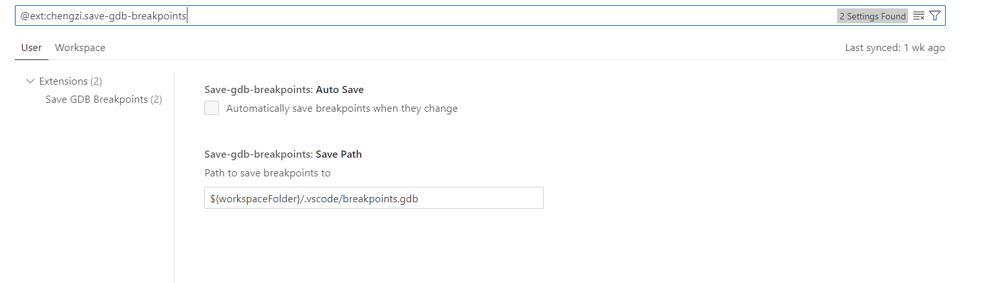

不知道其他人在使用 gdb 调试程序的时候，是否会把断点保存到一个文件。

然后修改代码之后，不停的去调整断点中的行号，比如把 `main.c:89` 调整成 `main.c:93`，特别是断点比较多的时候，这个调整过程非常的繁琐。

而现代的编辑器的断点通常会随着修改文件自动移动，比如添加一行，或者删除一行，断点位置就会随着光标的更改发生变化。这样把编辑和调试的过程融合到一起的方式非常的科学。

可是问题是，有的时候，不是很方便使用 vscode 开始一个调试，比方说：

- 我们难以启动调试，特别是系统调试的时候，launch.json 很难去写
- 有的时候我们需要使用 gdb 脚本去做一些准备工作，比如在特定的地方断点，获取偏移，然后 add-symbol-file
- 需要经常使用 x 命令去查看内存，vscode 的内存视图特别难用，debug console 每次需要输入 -exec，而且显示出来的效果比终端差。 

一开始，我想写个 neovim 插件，去完成这件事，但是 neovim 原生并不支持断点，全靠 dap 插件，vscode原生对调试支持就比较好，所以最后我开发了一个 vscode 插件。

## Save GDB Breakpoints

目前该插件已经上架到 vscode extension marketplace。

使用时，只需要配置保存路径，勾上自动保存，就可以愉快的使用了。

目前该插件支持条件断点，日志点，但是暂不支持跳过次数（因为在文件中并不知道 gdb 的断点号，而 gdb `ignore` 需要断点号）。

日志点为了兼容 vscode 的日志点语法，比如 `a is {a}`，并没有采用 gdb 的 printf，而是调用了python，使用了python 的字符串格式化去完成打印，比如处理成 `print("a is {}.".format(gdb.parse_and_eval('a')))`。

欢迎大家去插件市场下载这个插件 / 给一个好评，感激不尽。

