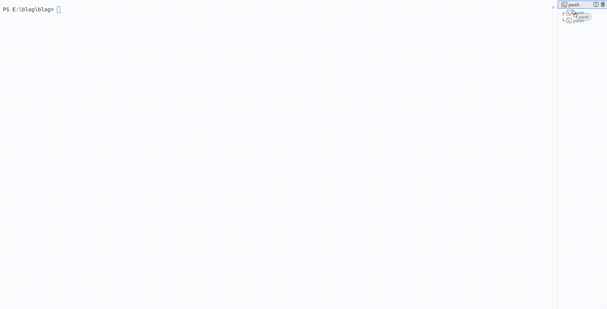

在一些图形化终端模拟器中，可以使用鼠标拖拽的方式来移动窗格，如下图是在 vscode 的终端模拟器
中重新排列窗格的操作。



可是在 tmux 中，我们如何完成这种任意排布的操作呢？

tmux 提供两个快捷键，分别是 `prefix + {` （prefix 默认为 \<C-b\>） 和 `prefix + }`，用来在窗口之间移动窗格。这对应的是 `swap-pane -D` 和 `swap-pane -U` 命令。虽然这个命令比较常用，默认也有快捷键映射，但是这个命令不能修改已有格子的排布，只能在格子之间移动窗格。


```
1   | 2
    ├----
    | 3
```
比如，不能把上面这种形式的窗格排布，通过这种命令变成下面的排布。


```
1   | 3
----┤
2   | 
```

tmux 提供了重新排布窗格的方法，即 `join-pane` 命令。这个命令可以将一个窗格加入到另一个窗格中，从而实现重新排布窗格的目的。

操作是 `prefix + :` 进入命令模式，然后输入 `join-pane -s <source-pane> -t <target-pane>`，其中 `<source-pane>` 是要移动的窗格，`<target-pane>` 是要移动到的窗格。

如果这样操作的话，需要输入窗格的编号，这个编号在 tmux 中是不容易看到的，而且操作过于繁琐。

tmux 也提供了一个更方便的方法：
1. 可以先使用快捷键 `prefix + m` 来标记一个窗口，被标记的窗口四周会被加粗
2. 然后把光标移动到要移动的窗格上（可以使用 `prefix + w` 或者其他操作切换）
3. 按下 `prefix + :` 进入命令模式，输入 `joinp` 并回车，这样就可以把标记的窗格移动到当前窗格中。

如果需要水平分割，加一个 `-h` 下选项就可以了。如果需要经常进行这个操作，可以把他映射成一个快捷键，这样可以做到几次键盘按键完成窗格移动，相对来说还是很方便的，和鼠标拖拽的效率不相上下。
