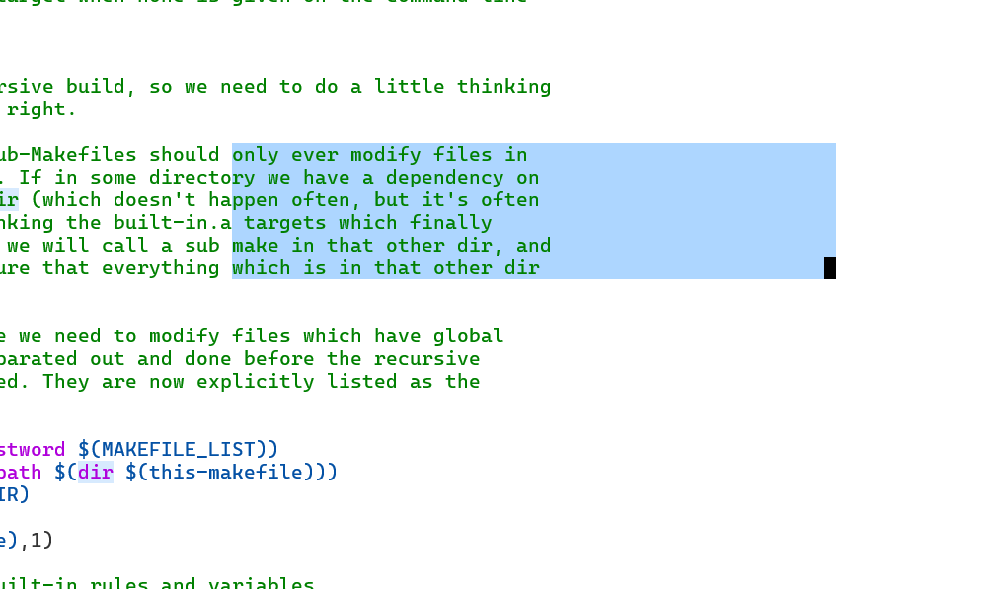
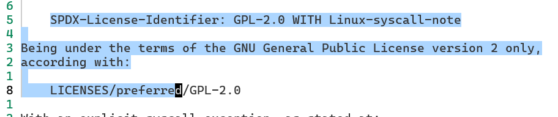

## virtualedit

今天发现 AstroNvim 的 visual block 表现地非常的奇怪。

像下图这样，在进入 visual block 模式后，光标可以一直按 <key>l</key> 进行移动，可以移动到文字的外面，这和默认配置的 vim 表现行为的不一样。



于是翻了一会 AstroNvim 的源码，发现了[这一行](https://github.com/AstroNvim/AstroNvim/blob/62a0a7a0d7ad4b2d2fc00d3eb804ac8ae5b03822/lua/astronvim/plugins/_astrocore_options.lua#L45C1-L45C83)：

```lua
    opt.virtualedit = "block" -- allow going past end of line in visual block mode
```

于是，打开`:help 'virtualedit'` 看了看这个选项的文档，`block` 说明在 virtual block 模式下启用，除此以外可以在 insert 模式启用。

尝试了一下这个选项的行为，发现其在普通编辑模式下并不好用，如果开启 virtualedit 选中了一个矩形区域并复制，即使选区的时候按的是 <key>$</key>，粘贴出来的区域的行尾也会包含大量空格，非常的奇怪。

当然，这个选项在绘制表格的时候还是很好用的，可以先选择空白区域，然后按 <key>A</key> ，最后输入竖线就可以快速绘制一个表格。


## visual 模式切换光标位置

在阅读文档的过程中，发现了另一个小技巧。

举个例子，我想把光标从选区最后 d 的位置切换到最开头的 S，只需要按 <key>o</key>，这种方式在 visual、visual block 和 visual line 的模式都可以使用。



visual block 的选区有 4 个角，其实这4个角都是可以相互切换的，<key>o</key> 切换的是对角，<key>O</key> 切换的是同一行的另一个角。

这个小技巧在使用 visual 模式的时候还是挺常用的。 
